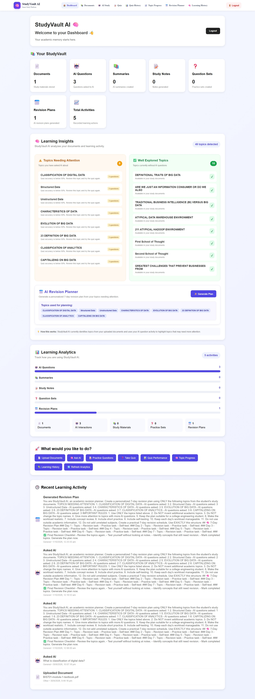
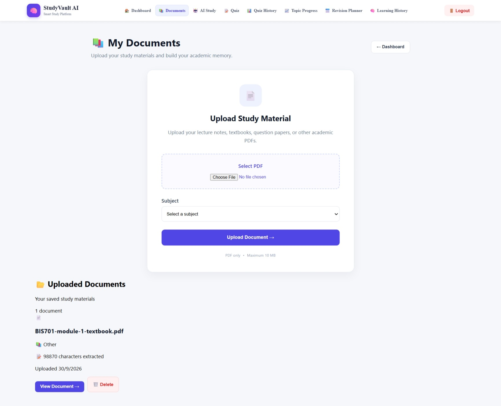
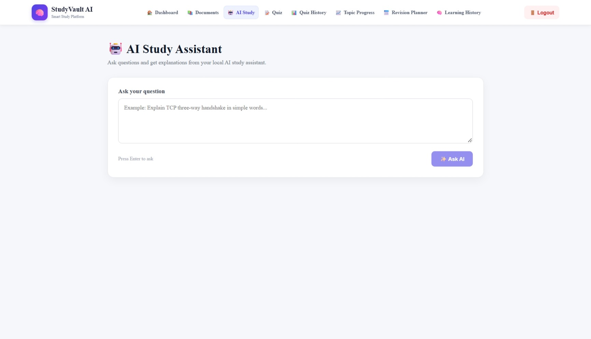
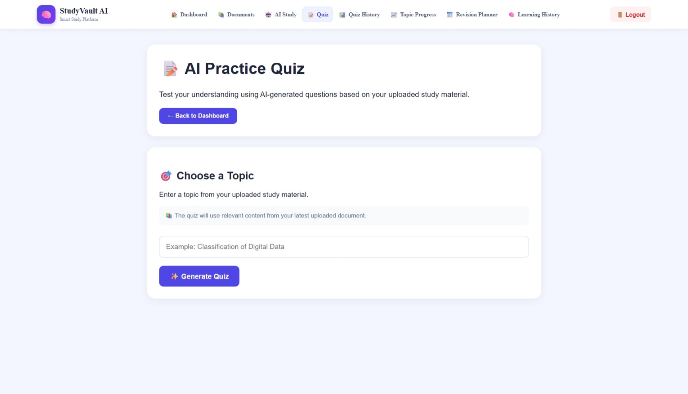


# 📚 StudyVault AI

StudyVault AI is an AI-powered study platform designed to help students organize study materials, understand documents, practice with AI-generated quizzes, track learning progress, and create personalized revision plans.

The platform combines **React, Node.js, Express, MongoDB, OCR, Retrieval-Augmented Generation (RAG), and local Large Language Models (LLMs)** to provide an intelligent and privacy-friendly study experience.

---

## 🚀 Features

### 📄 Study Material Management
- Upload PDF study materials
- Extract text from digital PDFs
- OCR support for scanned/image-based PDFs
- View extracted document content
- Organize study materials by subject

### 🤖 AI Study Assistant
- Ask questions about uploaded study materials
- Generate document-based summaries
- Generate study notes
- Generate practice questions
- Uses local **Qwen 2.5 7B** through Ollama

### 🔎 Retrieval-Augmented Generation (RAG)
- Splits large documents into manageable chunks
- Retrieves relevant sections based on the student's question
- Provides document-grounded AI responses
- Reduces irrelevant AI-generated information

### 📝 AI Quiz Generation
- Generates quizzes from uploaded study materials
- Supports 10-question practice quizzes
- Evaluates answers automatically
- Calculates score and accuracy
- Shows answer review after submission

### 📊 Learning Analytics
- Track AI interactions
- Track quiz performance
- View quiz history
- Monitor topic progress
- Identify topics that need more attention

### 📅 Revision Planner
- Generates personalized 7-day revision plans
- Uses learning activity and weak-topic information
- Helps students plan focused revision

### 📈 Dashboard
- Study activity overview
- Document count
- AI interaction statistics
- Quiz statistics
- Revision plan statistics
- Topic-based learning insights

### 🔐 Authentication
- User registration
- User login
- User-specific learning data
- Secure separation of user study activities

---

## 🛠️ Technology Stack

### Frontend
- React
- Vite
- React Router
- JavaScript
- HTML5
- CSS3

### Backend
- Node.js
- Express.js
- REST APIs
- Multer

### Database
- MongoDB
- Mongoose

### AI / Machine Learning
- Ollama
- Qwen 2.5 7B
- Retrieval-Augmented Generation (RAG)

### Document Processing
- pdf-parse
- pdf-poppler
- Tesseract OCR

### Development Tools
- Visual Studio Code
- Git
- GitHub

---

## 🏗️ System Architecture

```text
                    ┌─────────────────────┐
                    │       Student       │
                    └──────────┬──────────┘
                               │
                               ▼
                    ┌─────────────────────┐
                    │   React + Vite      │
                    │     Frontend        │
                    └──────────┬──────────┘
                               │
                         REST API
                               │
                               ▼
                    ┌─────────────────────┐
                    │ Node.js + Express   │
                    │      Backend        │
                    └──────┬───────┬──────┘
                           │       │
              ┌────────────┘       └─────────────┐
              ▼                                  ▼
     ┌─────────────────┐                 ┌─────────────────┐
     │    MongoDB      │                 │  Ollama +       │
     │ User & Learning │                 │ Qwen 2.5 7B     │
     │     Data        │                 │      LLM        │
     └─────────────────┘                 └────────┬────────┘
                                                  │
                                                  ▼
                                         ┌─────────────────┐
                                         │      RAG        │
                                         │ Chunking +      │
                                         │ Retrieval       │
                                         └─────────────────┘

             PDF Upload
                 │
                 ▼
       ┌─────────────────────┐
       │ PDF Text Extraction │
       │        +            │
       │     Tesseract OCR   │
       └─────────────────────┘
```

---

## 🔄 Application Workflow

```text
User Login
    ↓
Upload Study Material
    ↓
PDF Text Extraction
    ↓
OCR if Required
    ↓
Store Document + Extracted Text
    ↓
RAG Chunking & Retrieval
    ↓
AI Study Assistant
    ├── Ask Questions
    ├── Generate Summary
    ├── Generate Notes
    └── Generate Questions
    ↓
AI Quiz
    ↓
Quiz Evaluation
    ↓
Learning Analytics
    ↓
Weak Topic Detection
    ↓
Personalized Revision Plan
```

---

## 📸 Screenshots

### 🏠 Dashboard

The dashboard provides an overview of study materials, AI interactions, revision plans, and learning activities.



### 📄 Study Material Management

Students can upload PDF study materials and organize them for AI-powered learning.



### 🤖 AI Study Assistant

The AI Study Assistant allows students to ask questions and receive explanations from their local AI study assistant.



### 📝 AI Practice Quiz

The quiz module generates AI-powered practice questions based on uploaded study material.



### 📊 Topic-wise Learning Progress

The topic progress module tracks learning activity, quiz performance, and topics that need additional attention.



---

## 📂 Project Structure

```text
StudyVault-AI/
│
├── client/
│   ├── public/
│   └── src/
│       ├── pages/
│       │   ├── AIStudyAssistant.jsx
│       │   ├── Dashboard.jsx
│       │   ├── DocumentViewer.jsx
│       │   ├── Documents.jsx
│       │   ├── LearningHistory.jsx
│       │   ├── Login.jsx
│       │   ├── Quiz.jsx
│       │   ├── QuizHistory.jsx
│       │   ├── Register.jsx
│       │   ├── RevisionPlanner.jsx
│       │   └── TopicProgress.jsx
│       │
│       ├── App.jsx
│       ├── Navbar.jsx
│       └── index.css
│
├── server/
│   ├── models/
│   │   ├── Document.js
│   │   ├── LearningActivity.js
│   │   ├── QuizResult.js
│   │   └── User.js
│   │
│   ├── rag/
│   │   ├── chunker.js
│   │   ├── ragService.js
│   │   └── testRag.js
│   │
│   ├── routes/
│   │   ├── aiRoutes.js
│   │   ├── authRoutes.js
│   │   ├── documentRoutes.js
│   │   ├── learningRoutes.js
│   │   ├── quizRoutes.js
│   │   └── topicRoutes.js
│   │
│   └── server.js
│
├── screenshots/
│   ├── dashboard.png
│   ├── documents.png
│   ├── ai-study-assistant.png
│   ├── quiz.png
│   └── topic-progress.png
│
├── .gitignore
├── package.json
├── package-lock.json
└── README.md
```

---

## ⚙️ Installation

### 1. Clone the repository

```bash
git clone https://github.com/bhrama123/StudyVault-AI.git
cd StudyVault-AI
```

### 2. Install root dependencies

```bash
npm install
```

### 3. Install client dependencies

```bash
cd client
npm install
```

### 4. Install server dependencies

```bash
cd ../server
npm install
```

---

## 🔧 Environment Configuration

Create:

```text
server/config.env
```

Add your local configuration:

```env
PORT=5001
MONGO_URI=mongodb://127.0.0.1:27017/studyvault
```

Keep API keys and environment files private.

**Never commit `server/config.env` to GitHub.**

---

## 🧠 Setting Up Ollama

Install Ollama and download the Qwen model:

```bash
ollama pull qwen2.5:7b
```

Start Ollama before running the application.

The application uses the local Ollama service for AI-powered study features.

---

## ▶️ Running the Application

### Start MongoDB

Make sure your local MongoDB service is running.

### Start Ollama

```bash
ollama serve
```

### Start the backend

From the `server` directory:

```bash
npm run dev
```

Backend:

```text
http://localhost:5001
```

### Start the frontend

From the `client` directory:

```bash
npm run dev
```

Frontend:

```text
http://localhost:5173
```

---

## 📊 Main Modules

| Module | Purpose |
|---|---|
| Authentication | User registration and login |
| Documents | Upload and manage study materials |
| Document Viewer | Read extracted document content |
| AI Study Assistant | Ask questions and generate study content |
| RAG | Retrieve relevant document sections |
| Quiz | Generate and evaluate AI quizzes |
| Quiz History | Track previous quiz attempts |
| Topic Progress | Analyze topic-level performance |
| Learning History | Track learning activities |
| Revision Planner | Generate personalized revision plans |
| Dashboard | Overall study analytics |

---

## 🎯 Project Objectives

- Provide students with an intelligent study assistant.
- Convert static study materials into interactive learning resources.
- Support both digital and scanned PDF documents.
- Generate document-grounded AI responses.
- Provide automated quiz generation and evaluation.
- Track learning activities and topic performance.
- Identify topics that require additional attention.
- Generate personalized revision plans.
- Reduce dependency on paid cloud AI APIs by supporting local LLM inference.

---

## 🌟 Key Highlights

- Full-stack MERN-based application
- Local AI using Qwen 2.5 7B
- RAG-based document question answering
- OCR support for scanned PDFs
- Automated quiz generation
- Quiz performance analytics
- Topic progress tracking
- Personalized revision planning
- Responsive web interface
- MongoDB-based persistent learning history

---

## 🔒 Privacy

StudyVault AI is designed to support local processing.

Study materials can be processed locally using:

- Local MongoDB
- Local Ollama
- Local Qwen 2.5 7B
- Local Tesseract OCR

Sensitive configuration files and uploaded study materials are excluded from Git using `.gitignore`.

---

## 🔮 Future Enhancements

- Semantic embeddings and vector database integration
- Advanced personalized learning recommendations
- More detailed knowledge graphs
- Spaced-repetition scheduling
- Flashcard generation
- Advanced exam/PYQ analysis
- More comprehensive learning analytics
- Cloud deployment
- Mobile application
- Multi-language study support

---

## 👩‍💻 Author

**Bhramarambhika**

B.E. – Information Science & Engineering  
Bangalore Institute of Technology

---

## 📄 License

This project is developed for educational and academic purposes.